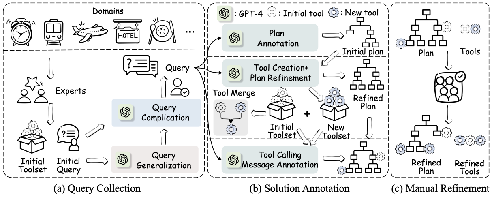
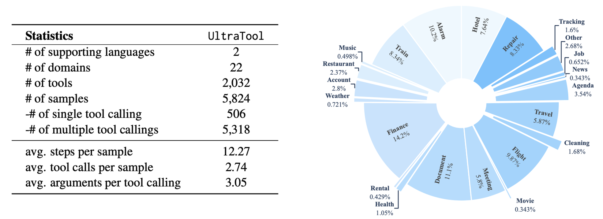
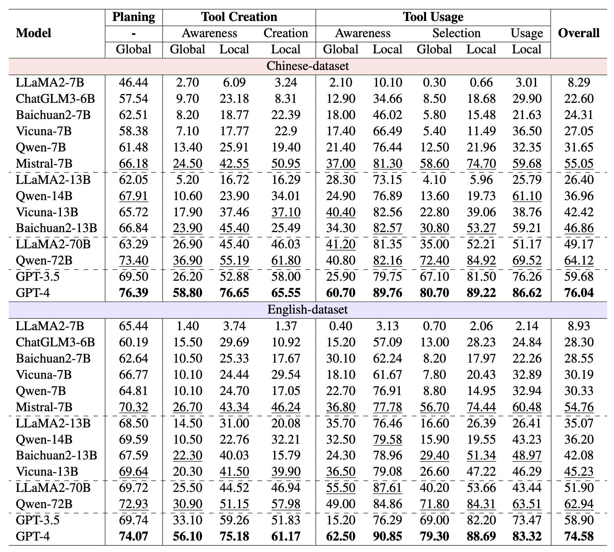

# Planning, Creation, Usage: Benchmarking LLMs for Comprehensive Tool Utilization in Real-World Complex Scenarios

## ✨Introduction

The recent trend of using Large Language Models (LLMs) as tool agents in real-world applications underscores the necessity for comprehensive evaluations of their capabilities, particularly in complex scenarios involving planning, creating, and using tools. However, existing benchmarks typically focus on simple synthesized queries that do not reflect real-world complexity, thereby offering limited perspectives in evaluating tool utilization. To address this issue, we present UltraTool, a novel benchmark designed to improve and evaluate LLMs' ability in tool utilization within real-world scenarios. UltraTool focuses on the entire process of using tools - from planning and creating to applying them in complex tasks. It emphasizes real-world complexities, demanding accurate, multi-step planning for effective problem-solving. A key feature of UltraTool is its independent evaluation of planning with natural language, which happens before tool usage and simplifies the task solving by mapping out the intermediate steps. Thus, unlike previous work, it eliminates the restriction of pre-defined toolset during planning. Through extensive experiments on various LLMs, we offer novel insights into the evaluation of capabilities of LLMs in tool utilization, thereby contributing a fresh perspective to this rapidly evolving field.





## 🚀What's New

- **[2024.03.04]** Release evaluation code, inference code for GPT-3.5 and GPT-4, and prediction results of GPT-3.5 and GPT-4.
- **[2024.01.31]** Release data of UltraTool, the code for evaluation is on its way.
- **[2023.01.31]** Paper available on [ArXiv](https://arxiv.org/abs/2401.17167). 

## 📂Folders

The repository is structured as follows:

```bash
├── data/ # data
│   ├── Chinese-dataset/ # data in Chinese
│   │   ├── example/ # few-shot examples when inference
│   │   │   ├── planning.json 
│   │   │   └── ...
│   │   ├── test_set/ # test set
│   │   │   ├── planning.json
│   │   │   └── ...
│   │   ├── test.json # test data that used for constructing the test set
│   │   └── dev.json # optional development set
│   ├── English-dataset/ # data in English
│   │   ├── example/ 
│   │   │   ├── planning.json
│   │   │   └── ...
│   │   ├── test_set/ 
│   │   │   ├── planning.json
│   │   │   └── ...
│   │   ├── test.json 
│   │   └── dev.json 
├── evaluation/ # evaluation scripts
├── inference/ # inference scripts
├── Predictions/
│   ├── Chinese-dataset/ # prediction results on Chinese-dataset
│   │   ├── gpt-3.5/ # prediction results of gpt-3.5
│   │   │   ├── eval/ 
│   │   │   │   ├── inferback/ # temporary results
│   │   │   │   ├── planning_eval.json # gpt-4 evaluation results for planning
│   │   │   │   ├── tool_creation_eval.json # gpt-4 evaluation results for tool creation
│   │   │   │   └── tool_creation_post_process.json # post-process results for tool creation
│   │   │   ├── inferback/ # temporary results
│   │   │   ├── planning.json # prediction results for planning
│   │   │   └── ...
│   │   ├── ...
│   ├── English-dataset/ # prediction results on English-dataset
│   │   ├── gpt-3.5/
│   │   │   ├── eval/ 
│   │   │   │   ├── inferback/ 
│   │   │   │   ├── planning_eval.json 
│   │   │   │   ├── tool_creation_eval.json 
│   │   │   │   └── tool_creation_post_process.json 
│   │   │   ├── inferback/ 
│   │   │   ├── planning.json 
│   │   │   └── ...
│   │   ├── ...
```

## 🛠️Quick start

### Preparations

```python
$ git clone https://github.com/JoeYing1019/UltraTool.git
$ cd UltraTool
$ pip install requirements.txt
```

### Inference 

We offer the inference code for both GPT-3.5 and GPT-4.

```
# inference gpt-3.5 on Chinese-dataset of all six tasks
python inference/inference_openai.py --model gpt-3.5 --language ch --tasks ['planning', 'tool_usage_awareness', 'tool_creation', 'tool_usage', 'tool_creation_awareness', 'tool_selection']

# inference gpt-3.5 on English-dataset of all six tasks
python inference/inference_openai.py --model gpt-3.5 --language en --tasks ['planning', 'tool_usage_awareness', 'tool_creation', 'tool_usage', 'tool_creation_awareness', 'tool_selection']

# inference gpt-4 on Chinese-dataset of all six tasks
python inference/inference_openai.py --model gpt-4 --language ch --tasks ['planning', 'tool_usage_awareness', 'tool_creation', 'tool_usage', 'tool_creation_awareness', 'tool_selection']

# inference gpt-4 on English-dataset of all six tasks
python inference/inference_openai.py --model gpt-4 --language en --tasks ['planning', 'tool_usage_awareness', 'tool_creation', 'tool_usage', 'tool_creation_awareness', 'tool_selection']
```

The inference results will be saved in `predictions` and we have provided the inference results of GPT-3.5 and GPT-4 in `predictions`.

Additionally, the inference code and results for other open-source LLMs will be made available in the future.

### Evaluation

#### Planning

The evaluation of planning relies on GPT-4, with the evaluation pipeline structured as follows:

```
# evaluate gpt-3.5 and gpt-4 on Chinese-dataset
python evaluation/inference_planning_eval.py --models ['gpt-3.5', 'gpt-4'] --language ch
python evaluation/planning.py --models ['gpt-3.5', 'gpt-4'] --language ch

# evaluate gpt-3.5 and gpt-4 on English-dataset
python evaluation/inference_planning_eval.py --models ['gpt-3.5', 'gpt-4'] --language en
python evaluation/planning.py --models ['gpt-3.5', 'gpt-4'] --language en
```

#### Tool creation

Similar to planning evaluation, the evaluation of tool creation also depends on GPT-4. However, it requires an additional post-processing step. The evaluation pipeline is as follows:

```
# evaluate gpt-3.5 and gpt-4 on Chinese-dataset
python evaluation/post_process_tool_creation.py --models ['gpt-3.5', 'gpt-4'] --language ch
python evaluation/inference_tool_creation_eval.py --models ['gpt-3.5', 'gpt-4'] --language ch
python evaluation/tool_creation.py --models ['gpt-3.5', 'gpt-4'] --language ch

# evaluate gpt-3.5 and gpt-4 on English-dataset
python evaluation/post_process_tool_creation.py --models ['gpt-3.5', 'gpt-4'] --language en
python evaluation/inference_tool_creation_eval.py --models ['gpt-3.5', 'gpt-4'] --language en
python evaluation/tool_creation.py --models ['gpt-3.5', 'gpt-4'] --language en
```

#### Tool creation awareness

```
# evaluate gpt-3.5 and gpt-4 on Chinese-dataset
python evaluation/tool_creation_awareness.py --models ['gpt-3.5', 'gpt-4'] --language ch

# evaluate gpt-3.5 and gpt-4 on English-dataset
python evaluation/tool_creation_awareness.py --models ['gpt-3.5', 'gpt-4'] --language en
```

#### Tool usage awareness

```
# evaluate gpt-3.5 and gpt-4 on Chinese-dataset
python evaluation/tool_usage_awareness.py --models ['gpt-3.5', 'gpt-4'] --language ch

# evaluate gpt-3.5 and gpt-4 on English-dataset
python evaluation/tool_usage_awareness.py --models ['gpt-3.5', 'gpt-4'] --language en
```

#### Tool selection

```
# evaluate gpt-3.5 and gpt-4 on Chinese-dataset
python evaluation/tool_selection.py --models ['gpt-3.5', 'gpt-4'] --language ch

# evaluate gpt-3.5 and gpt-4 on English-dataset
python evaluation/tool_selection.py --models ['gpt-3.5', 'gpt-4'] --language en
```

#### Tool usage

```
# evaluate gpt-3.5 and gpt-4 on Chinese-dataset
python evaluation/tool_usage.py --models ['gpt-3.5', 'gpt-4'] --language ch

# evaluate gpt-3.5 and gpt-4 on English-dataset
python evaluation/tool_usage.py --models ['gpt-3.5', 'gpt-4'] --language en
```

## 📈Benchmark Results



## ✏️ Citation

If you find this project useful in your research, please cite:

```
@misc{huang2024planning,
      title={Planning, Creation, Usage: Benchmarking LLMs for Comprehensive Tool Utilization in Real-World Complex Scenarios}, 
      author={Shijue Huang and Wanjun Zhong and Jianqiao Lu and Qi Zhu and Jiahui Gao and Weiwen Liu and Yutai Hou and Xingshan Zeng and Yasheng Wang and Lifeng Shang and Xin Jiang and Ruifeng Xu and Qun Liu},
      year={2024},
      eprint={2401.17167},
      archivePrefix={arXiv},
      primaryClass={cs.CL}
}
```
